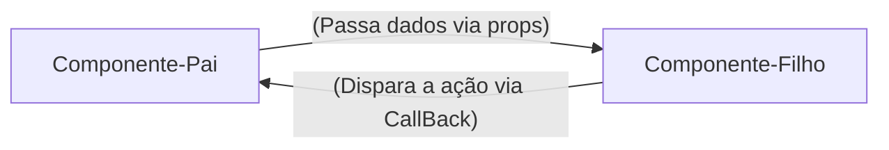
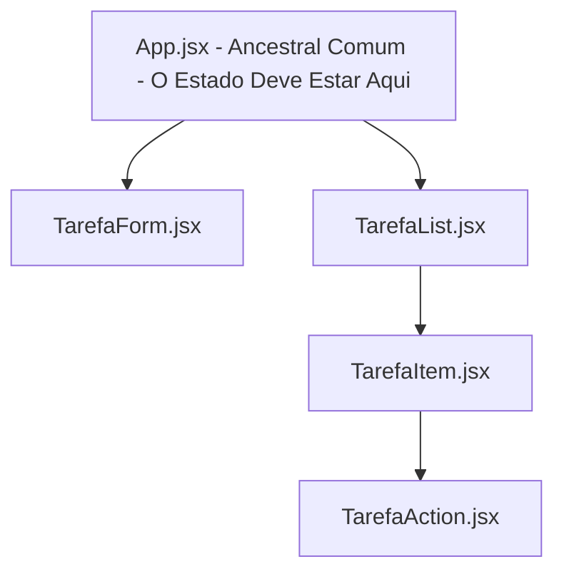

# REACT - Guia Rápido e Anotações

**Unidade Curricular:** Desenvolvimento FrontEnd
**Conteúdo:** Desenvolvimento de Frameworks - REACT

## Semana 1 - Introdução ao React e Ambiente de Desenvolvimento

### 1. O que é React?

- Uma Biblioteca JavaScript para criação de interfaces de Usuário (UI)
- Funciona de forma **declarativa**: você descreve o resultado esperado com base nos dados, e o React atualiza o navegador.
- Cria *SPAs* (Single Page Applications): atualiza partes da tela sem recarregar a página inteira.

### 2. React vs JavaScript Vanilla: DOM Tradicional vs Virtual DOM

O DOM no JavaScript tradicional é imperativo: procura a tag, muda o componente e atualiza a página.

React (Declarativo): UI=Componente(dados) -> Quando os dados mudam, o React atualiza o componente.

### 3. Comandos essenciais no terminal

```bash
# Criar projeto com o Vite (framework React)
npm create vite@latest nome-projeto --template react

# Atualizar e instalar dependências do node_modules
npm install

# Iniciar o servidor local (http://localhost:5173)
npm run dev

```

### 4. Sintaxe do primeiro componente JSX (permite escrever códigos parecidos com HTML diretamente dentro do arquivo de script)

```jsx
//src/App.js
//Componente Raiz da Aplicação
function App(){
    const sistema = "Meu Site";

    return(
        <main>
            <h1>{sistema}</h1>
                    <p>Gerencie seus componentes em um só lugar</p>
        </main>
    );
}

export default App;
```

> Obs: O JSX exibe **uma única tag raiz** (ou fragmento `<> ... </>`) e nomes de componentes sempre começam com a letra **Maiúscula** (UpperCamelCase).

---

## Semana 2 - JSX, Componentes, Props e Eventos

### 1. Responsabilidade Única (SOLID)
- Quebrar a tela em componentes pequenos. Cada componente deve fazer apenas uma única coisa bem feita:

**Exemplo de componentes:**
- `Header`: cuida do título e do cabeçalho da aplicação
- `Footer`: cuida do rodapé da aplicação
- `NavBar`: cuida da barra de navegação do site

> Obs.: o princípio do SOLID estabelece que uma unidade de software deve ter apenas um motivo para mudar.

### 2. Props: passagem de dados e fluxo unidirecional

**O que são Props?**

As props são argumentos ou parâmetros das funções, já que um componente React é uma função JavaScript. Ou seja, as props (abreviação de properties) permitem que o componente pai envie dados dinamicamente para o componente filho, tornando-o customizável e reutilizável.

### 3. Eventos e Comunicação via Callbacks

O React encapsula eventos nativos em objetos. A diferença do React para o HTML é a sintaxe:
- no HTML: `onclick="minhaFuncao()"`
- no React JSX : `onClick={minhaFuncao}`

> Funções em JavaScript devem seguir o padrão lowerCamelCase de escrita.



### 4. Listas dinâmicas com `map()` e a propriedade `key`

**Porque Arrays são estruturas padrão do FrontEnd?**

Os dados chegam de bancos de dados e APIs no formato de coleções (JSON).

O método `.map()` percorre cada item de um array e retorna um novo componente JSX.

Exemplo:

```jsx
tarefas.map((tarefa)=>(
    <TarefaItem
        key={tarefa.id}
        id={tarefa.id}
        titulo={tarefa.titulo}
        descricao={tarefa.descricao}
        completa={tarefa.completa}
    />
))
```

**Por que o React exige o `key` no uso do `.map()`?**

Quando o React renderiza uma lista, precisa saber de forma inequívoca qual item específico foi adicionado, alterado ou removido. Se a chave for omitida, o React emite um aviso no console: `Warning: Each child in a list should have a unique "key" prop.`

> Evite o índice do array como chave `(key={index})`: o índice do vetor não é fixo. Use sempre uma chave única para os itens da lista (carimbo de data e hora, ID único etc.).

### Componentes de Formulário Estático:

Criando o Arquivo `TarefaForm.jsx`

---

## Semana 3 - Estado, Formulário e CRUD em Memória

**Tema:** transição de uma interface estática para uma aplicação reativa, trabalho com o hook fundamental `useState`, construção de formulários com validação, CRUD completo, filtros e buscas textuais.

**Contextualização**: na Semana 2, houve a decomposição de uma tela monolítica em componentes reutilizáveis, a organização do fluxo das props e a captura de eventos.

### Bloco 1 - O Conceito de Estado e o hook `useState`

**Variável Comum vs. Estado Reativo**

```js
// variável comum do JS
function Contador(){
    let contador = 0;

    function incrementar(){
        contador += 1;
        console.log("Contador no console", contador); // exibe o número
    }

    return (
        <div>
            <p>Clique: {contador}</p>
            <button type="button" onClick={incrementar}>Somar</button>
        </div>
    )
}
```

Obs.:
* Funções JavaScript convencionais perdem suas variáveis locais ao término da execução.
* O React não monitora variáveis comuns. Ele não sabe que a variável mudou e, portanto, não tem motivo para redesenhar a tela
* O estado (state) é a memória do componente. Quando o estado é modificado por uma função, o React agenda uma nova execução da função do componente (renderização novamente), atualizando o Virtual DOM e o navegador.

**A Sintaxe do `useState`**

ao invés do `let contador =0;`

Usa-se:

```jsx
const [contador, setContador] = useState(0);
```
Obs:
* `contador`: a foto do dado no momento da renderização atual;
* `setContador`: a função despachante que atualiza o dado e notifica o React;
* `useState(0)`: define o valor com o qual o componente nasce.

**Chamando a Mudança de Estado**

o próximo valor sempre depende do valor anterior 

```jsx
// Forma segura e profissional de realizar a mudança de estado 
setContador((prevContador) => prevContador + 1);
// atualização funcional do valor

//Outra forma - profissional
setContador(contador + 1);
```

> Fazendo a Mudança no Aplicativo de Lista de Tarefas
> `React\lista-tarefas\src\App.jsx`

### Bloco 2 - Elevação de Estado (Lifting State Up)

A comunicação entre os componentes: para que dois ou mais componentes no React compartilhem ou modifiquem dados, o estado deve ser elevado ao ancestral comum entre eles.


Obs.:
1. O Estado `tarefas`reside no App.jsx
2. O App.jsx cria as funções de modificação (handleAddTarefa, handleMudarTarefa, handleDeletarTarefa);
3. Os dados descem como props para quem precisa usá-los
4. As funções descem como callbacks para quem precisa disparar a ação;

### Bloco 3 - Formulários Controlados e Validação

**Controlando Componentes (Controlled Components)**

No HTML tradicional, os inputs guardam seu próprio texto internamente no DOM. No React, a única fonte de armazenamento deve ser o próprio React.

Um input é controlado quando:
1. Seu atributo `value` está amarrado a um estado do React
2. Seu evento `onChange` atualiza esse mesmo estado a cada caractere digitado.

Exemplo de uso:
```jsx
const [titulo, setTitulo] = useState("");

<input
    type="text"
    value={titulo}
    onChange={(e) => setTitulo(e.target.value)}
/>
```

**Prevenindo o Recarregamento com `event.preventDefault()`**

Evita o comportamento nativo da web, que é submeter formulários e recarregar a página quando formulários ou eventos forem enviados.

```jsx
function handleSubmit(event){
    event.preventDefault(); //impede o carregamento da página
    //processamento dos dados
}
```

**Construir Formulário na Atividade Lista de Tarefas**
`React\lista-tarefas\src\components\TarefaForm.jsx`

---

### Bloco 4 - Operações CRUD na Memória

**Imutabilidade no React**

Para que o React detecte uma alteração em um objeto ou array, devemos criar uma nova cópia com a alteração desejada.

Métodos como `.push()`, `.unshift()` e `.pop()` não devem ser usados para modificar arrays no React, pois o React compara o objeto na memória, identifica que não houve mudança e conclui que não precisa fazer a renderização. A mudança só ocorre se for chamado o `useState` (mudança de estado).

**Operações de Imutabilidade no React**

* **Inserir**:

    `[novoItem, ...array]`
    // A mudança é feita criando um novo array com o novo item e espalhando os itens antigos.

* **Remover**:

    `array.filter(item => item.id !== id)`
    // A mudança é feita criando um novo array, filtrando os itens antigos e removendo o item desejado.

* **Atualizar**:

    `array.map(item => item.id === id ? {...item, completed: true} : item)`
    // A mudança é feita criando um novo array, mapeando os itens antigos e atualizando o item desejado.
    

**Adicionando as quatro operações do CRUD no App.jsx**
`React\lista-tarefas\src\App.jsx`

--


