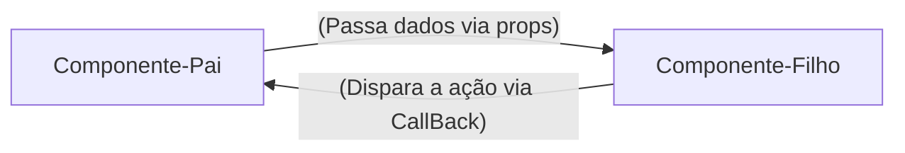

# REACT - Guia Rápido e Anotações

**Unidade Curricular:** Desenvolvimento FrontEnd
**Conteúdo:** Desenvolvimento de Frameworks - REACT

## Semana 1 - Introução ao React e Ambiente de Desenvolvimento

### 1. O que é React?

- Uma Biblioteca JavaScript para criação de interfaces de Usuário (UI)
- Funciona de forma **declarativa**: você descreve o resultado esperado com base nos dados,e o React atualiza o navegador.
- Cria *SPAs* (Single Page Applications): atualiza partes da tela sem recarregar a página inteira.

### 2. React vs JavaScript Vanilla: DOM Tradicional vs Virtual DOM

O DOM no JavaScript Tradicional é Imperativo: PRocura a tag, muda o componente e atualiza a página

React (Declarativo): UI=Componente(dados) -> Quando os dados mudam, o React atualiza o componente.

### 3. Comandos essenciais no terminal

```bash
#Criar projeto com o VITE(framework react)
npm create vite@latest nome-projeto --template

#atualizar e instalar depêndencias do node_modules
npm install

# Iniciar o servidor local (http://localhost:5173)
npm run dev

```

### 4. Sintaxe do primeiro componente JSX(permite escrever códigos parecidos com HTML diretamente dentro do arquivo de script)

```jsx
//src/App.js
//Componente Raiz da Aplicação
function App(){
    const sistema = "Meu site";

    return(
        <main>
        <h1>{sistema}</h1>
        <p>Gerencie seus componentes em um só lugar</p>
        </main>
    );
}

export default App;
```

> Obs: o JSX exibe **uma única tag raiz** (ou fragmento `<> ... </>`) e nomes de componentes sempre começam com a letra **Maiúscula** (UpperCamelCase).

---

## Semana 2 - JSX, Componente, Props e Eventos

### 1. Responsabilidade Única (SOLID)
- Quebrar a tela e componentes pequenos. Cada componente deve fazer apenas uma unica coisa bem feita:


**Exemplo de componentes:**
- `Header`: cuida do título e do cabeçalho da aplicação
- `Footer`: cuida do rodapé da aplicação
- `NavBar`: cuida da barra de navegação do site

> Obs: o principio do SOLID estabelece que uma unidade de software deve ter apenas um motivo para mudar

### 2. Props: passagem de dados e fluxo unidirecional

**O que são Props?**

Os props são argumentos  ou parâmetros das funções já que um componenete REACT é uma função JavaScript, ou seja, as props (abreviação de properties) permitem que o componente pai envie dados dinâmicamente para o componente filho, tornando-o customizavel e reutilizável.

### 3. Eventos e Comunicação via Callbacks

React encapsulamento de eventos nativos em objetos,a diferença do react para o HTML é a sintaxe
- no HTML :  `onclick="minhafuncao()`
- no React JSX : `onClick={minhaFuncao}`

> funções em JavaScriot deve seguir o padrão lowerCamelCase de escrita. 



### 4. Lista dinâmica com map() e a propriedades `key`

**Porque Arrays são estruturas padrão do FrontEnd?**

Os dados chegam de banco de dados e apis no formato de coleção (json) 

o método `.map()` percorre cada item de uma array e retorna um novo componente JSX

Exemplo:

```jsx
tarefas.map((tarefa)=>(
    <TarefaItem
        key={tarefa.id}
        id={tarefa.id}
        titulo={tarefa.titulo}
        descricao={tarefa.descricao}
        completa={tarefa.completa}
    />
))
```

*Porque o React Exige o `key` no uso do `.map()`*s

o React quando renderiza uma lista precisa saber de forma inequívoca qual item específico foi adicionado, alterado ou removido. Se a chave for omitida, o react emite um aviso no console: `Warning: Each child in a list should have a unique "key" prop.`

> evitar o índice do array como chave `(key={index})`: índice do vetor não é fixo, use sempre uma chave única para os item da lista ( carimbo de data e hora, id único, ) 

### Componentes de Formulário Estático:

Criando o Arquivo `TarefaForm.jsx`

---

## Semana 3 - Estado Formulário e CRUD em Memoria

**Tema:** transição de uma interface estática para uma aplicação reativa, trablho com o hook fundamental `useState`, construção de formulários com validação, Crud Completo, filtros e buscas textuais 

**Contextualização**: Na Semana 2, decomposição  de tela monolítica em componentes reutilizáveis, organização de fluxo dos props e captura de eventos

### Bloco 1 - O Conceito de Estado e o hook `useState`

**Variável Comum vs. Estado Reativo**

```js
// variável comum do JS
function Contador(){
    let contador = 0;

    function incremento(){
        contador += 1;
        console.log("Contador no console", contador); // exibe o número
    }

    return (
        <div>
            <p>Clique: {contador}</p>
            <button type="button" onClick={incremento}>Somar<button>
        </div>
    )
}
```

Obs:
* JavaScript convencionais perdem suas variáveis locias o termino da execução
* O React não monitora variáveis comuns. Ele não sabe que a variável mudou e, portanto, não tem motivo para redesenhar a tela
* O estado (state) é a memoria do componente. Quando o estado é modificado por uma função, o React agenda ua nova execução da função do componente (re-renderização), atualizando o Virtual DOM e o navegador.

**A Sintaxe do `useState`**

ao invés do `let contador =0;`

Usa-se:

```jsx
const [contador, setContador] = useState(0);
```
Obs:
* `contador`: a foto do dado no momento da renderização atual;
* `setContador`: a função despachante que atualiza o dado e notifica o React;
* `useState(0)`: define o valor com o qual o componente nasce.

**Chamando a Mudnaça de Estado**

o próximo valor sempre depende do valor anterior 

```jsx
// Forma segura e profissional de realizar a mudança de estado 
setContador((prevContador) => prevContador + 1);
// atualização funcional do valor

//Outra forma - profissional
setContador(contador + 1);
```

> Fazendo a Mudança no Aplicativo de Lista de Tarefas
> react2026\lista-tarefas\src\App.jsx